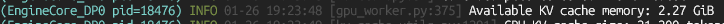
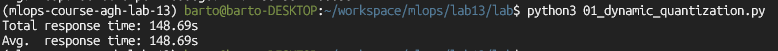
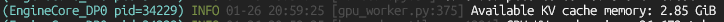
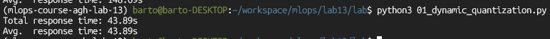
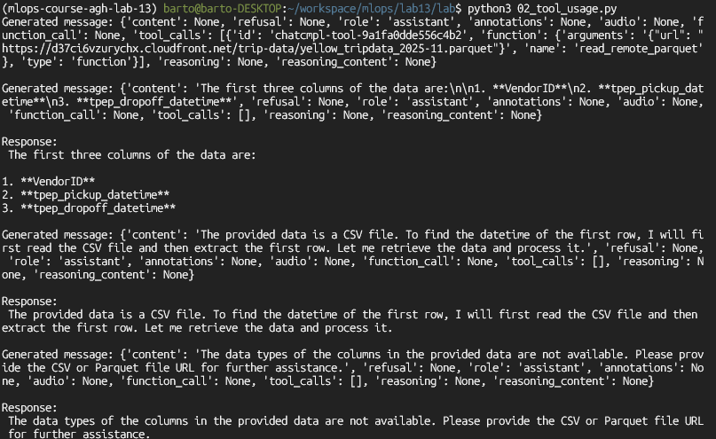
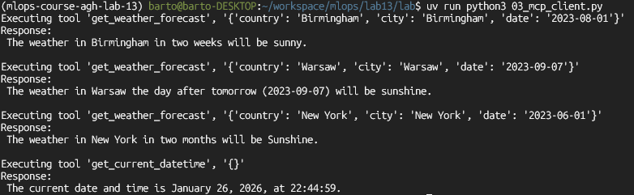
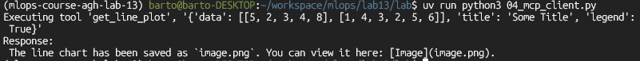
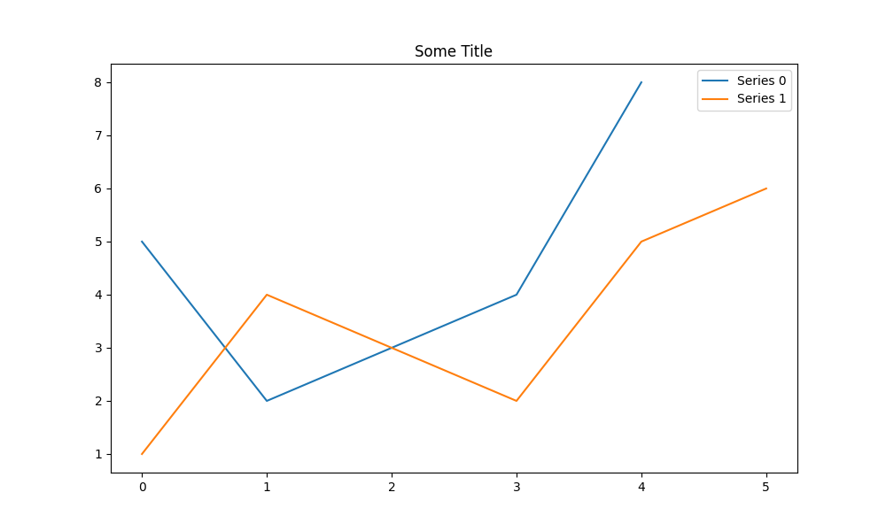
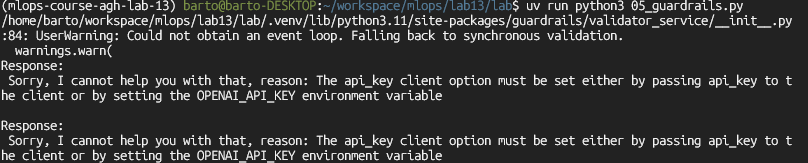

## Introduction

The excersises were done on a PC with GTX 1660 GPU with 6GB of VRAM thus I used
the smaller 0.6B model and added a `--gpu_memory_utilization 0.8` flag.

## Ex.1.

* inference time and KV cache size without dynamic quantization

* inference time and KV cache size with dynamic quantization

## Ex.2.

## Ex.3.

## Ex.4.

## Ex.5.

For some reason the `RestrictToTopic` guardrail returns some api key error.

